# 🐳 Projeto WordPress com Docker na AWS

Este projeto implementa uma infraestrutura escalável e segura na AWS, utilizando Docker para hospedar uma aplicação WordPress. Inclui serviços como Amazon RDS (MySQL), EFS, Load Balancer e Auto Scaling Group, seguindo boas práticas de DevOps para garantir performance e disponibilidade.

---

## 📌 Objetivo

- Deploy de WordPress containerizado em instância EC2
- Banco de dados MySQL via RDS
- Armazenamento persistente com EFS
- Balanceamento com Load Balancer
- Alta disponibilidade com Auto Scaling Group
- Infraestrutura com VPC personalizada (subnets públicas e privadas)

## 🗺️ Etapas da Implementação

Cada etapa está documentada com:

- ✅ Objetivo
- 🧭 Passo a passo
- 📸 Prints ilustrativos
- 🧾 Resumo técnico

---

## 📑 Sumário

- [🌎 Etapa 1 - 🌐 Criação da VPC Personalizada](#-etapa-1----criação-da-vpc-personalizada)
- [🌎 Etapa 2 - 🌐 Criação das Subnets](#-etapa-2----criação-das-subnets)
- [🌎 Etapa 3 - 🌐 Configuração das Route Tables (Tabelas de Rotas)](#-etapa-3----configuração-das-route-tables-tabelas-de-rotas)
- [🌎 Etapa 4 - 🌐 Criação e Configuração do Internet Gateway (IGW)](#-etapa-4----criação-e-configuração-do-internet-gateway-igw)
- [🌎 Etapa 5 - 🔐 Configuração dos Security Groups](#-etapa-5----configuração-dos-security-groups)
- [🌎 Etapa 6 - 🌐 Configurando o NAT Gateway para a Sub-rede Privada](#-etapa-6----configurando-o-nat-gateway-para-a-sub-rede-privada)
- [🌎 Etapa 7 - 🛢️ Criando o RDS (MySQL) para o WordPress](#-etapa-7---%EF%B8%8F-criando-o-rds-mysql-para-o-wordpress)
- [🌎 Etapa 8 - 🛢️ Criando o EFS (Elastic File System)](#-etapa-8---%EF%B8%8F-criando-o-efs-elastic-file-system)
- [🌎 Etapa 9 - 🚀 Guia de Criação da Instância EC2 (Amazon Linux 2)](#-etapa-9----guia-de-criação-da-instância-ec2-amazon-linux-2)
- [🌎 Etapa 10 - 🎯 Criação do Target Group](#-etapa-10----criação-do-target-group)
- [🌎 Etapa 11 - 🚦 Configuração do Load Balancer para WordPress](#-etapa-11----configuração-do-load-balancer-para-wordpress)
- [🌎 Etapa 12 - 🤖 Configuração do Auto Scaling Group para WordPress](#-etapa-12----configuração-do-auto-scaling-group-para-wordpress)

---


## 🌎 Etapa 1 - 🌐 Criação da VPC Personalizada

### ✅ Objetivo
Criar uma VPC personalizada com o bloco CIDR `10.0.0.0/16`, que servirá como base para a rede do projeto, contendo subnets públicas e privadas.

---

#### 🧭 Passo a Passo

#### 📌 1. Acessar o serviço VPC
- Acesse o Console da AWS.
- No menu superior, clique em **"Serviços"** e procure por **"VPC"**.

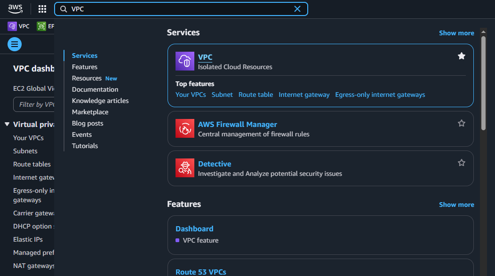

---

#### 📌 2. Criar uma nova VPC
- No menu lateral, clique em **"Your VPCs"** (ou **"Suas VPCs"**).
- Clique em **"Create VPC"**.

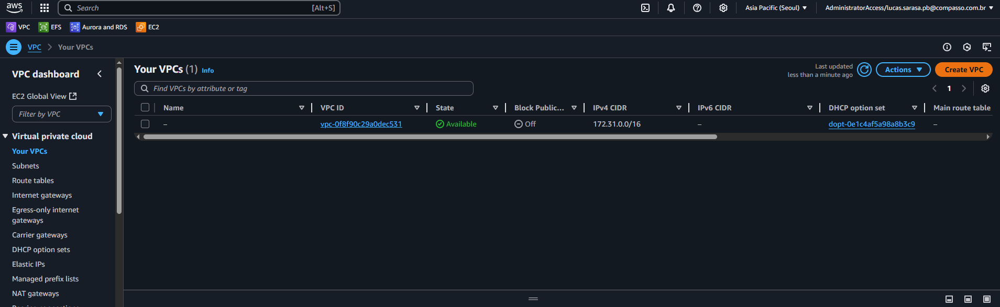

---

#### 📌 3. Configurar a VPC
Selecione a opção **"VPC only"** e preencha os campos:

| Campo               | Valor              |
|---------------------|--------------------|
| **Name tag**        | `vpc-wordpress`    |
| **IPv4 CIDR block** | `10.0.0.0/16`      |
| **Tenancy**         | `default`          |

- Deixe as opções de IPv6 e outras configurações como estão (em branco ou padrão).
- Clique em **"Create VPC"**.

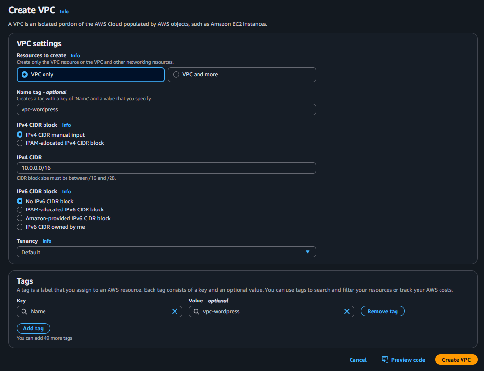

---

#### 📌 4. Verificar a VPC criada
- Após a criação, será exibida a lista de VPCs.
- Verifique se a VPC `vpc-wordpress` aparece com o CIDR `10.0.0.0/16` e status **available**.

---

### 🧾 Resumo Técnico da VPC

| Propriedade        | Valor             |
|--------------------|-------------------|
| Nome               | `vpc-wordpress`   |
| CIDR IPv4          | `10.0.0.0/16`     |
| Região             | `sa-east-1`       |
| Tenancy            | `default`         |
| IPv6               | Não configurado   |
| Subnets            | Ainda não criadas |
| Internet Gateway   | Ainda não criado  |

---

## 🌎 Etapa 2 - 🌐 Criação das Subnets

### ✅ Objetivo
Criar quatro subnets dentro da VPC `vpc-wordpress`, sendo:
- Duas subnets públicas (em AZs diferentes)
- Duas subnets privadas (em AZs diferentes)

Isso garante alta disponibilidade e tolerância a falhas, permitindo que os serviços sejam distribuídos entre zonas distintas.

---

#### 🧭 Passo a Passo

#### 📌 1. Acessar o menu de Subnets
- No Console da AWS, acesse o serviço **VPC**
- No menu lateral esquerdo, clique em **"Subnets"**
- Clique no botão **"Create subnet"**

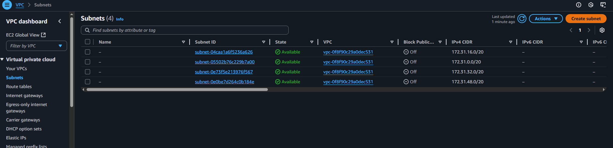


---

#### 📌 2. Preencher dados da VPC
- Selecione a **VPC** criada anteriormente: `vpc-wordpress`

---

#### 📌 3. Adicionar as Subnets

##### ➕ Subnet Pública - AZ1
| Campo             | Valor               |
|------------------|---------------------|
| Name tag         | `my-subnet-public-1` |
| Availability Zone| `sa-east-1a`         |
| IPv4 CIDR block  | `10.0.1.0/25`        |

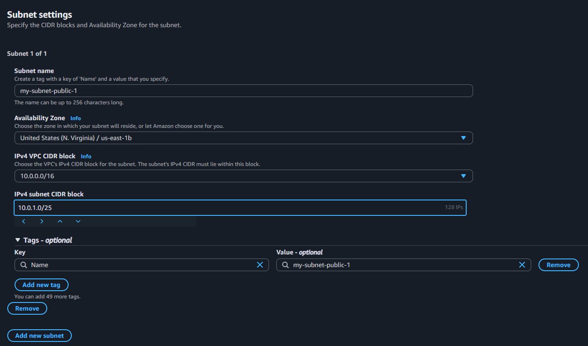


---

##### ➕ Subnet Pública - AZ2
| Campo             | Valor               |
|------------------|---------------------|
| Name tag         | `my-subnet-public-2` |
| Availability Zone| `sa-east-1b`         |
| IPv4 CIDR block  | `10.0.1.128/25`      |

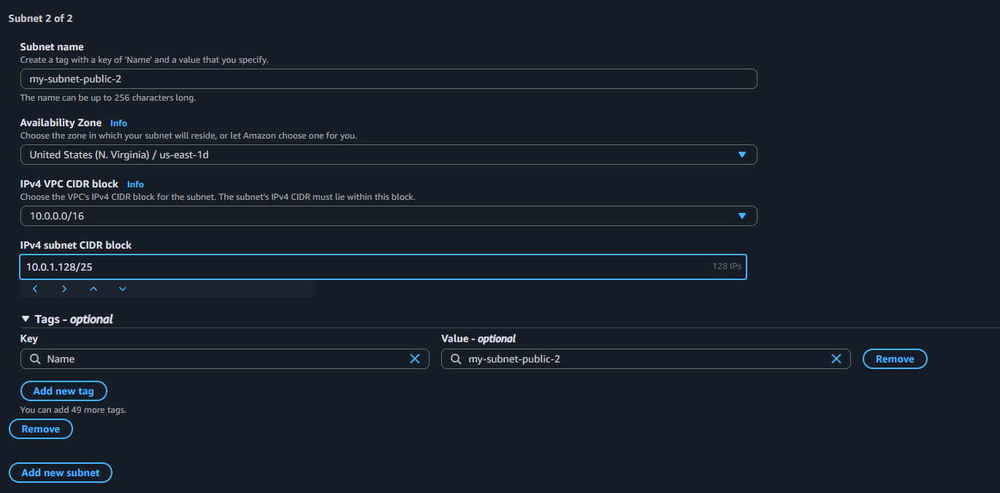

---

##### ➕ Subnet Privada - AZ1
| Campo             | Valor                |
|------------------|----------------------|
| Name tag         | `my-subnet-privada-1` |
| Availability Zone| `sa-east-1a`          |
| IPv4 CIDR block  | `10.0.2.0/25`         |

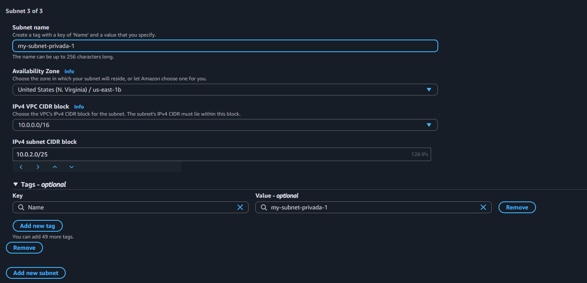

---

##### ➕ Subnet Privada - AZ2
| Campo             | Valor                |
|------------------|----------------------|
| Name tag         | `my-subnet-privada-2` |
| Availability Zone| `sa-east-1b`          |
| IPv4 CIDR block  | `10.0.2.128/25`       |

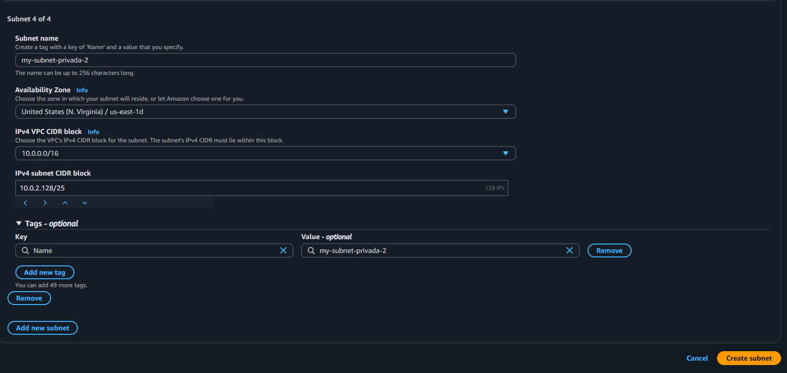

---

#### 📌 4. Criar as Subnets
- Após preencher as quatro subnets, clique no botão **"Create subnet"**

---

#### 📌 5. Verificar subnets criadas
- Após a criação, verifique se as quatro aparecem com os nomes corretos, nas zonas de disponibilidade certas e vinculadas à VPC `vpc-wordpress`

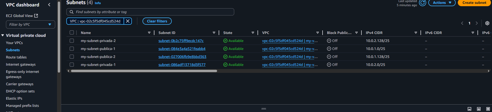

---

### 🧾 Resumo Técnico das Subnets

| Nome                | Tipo     | Zona         | CIDR           | Observações                  |
|---------------------|----------|--------------|----------------|------------------------------|
| my-subnet-public-1  | Pública  | sa-east-1a   | 10.0.1.0/25    | Load Balancer / NAT Gateway |
| my-subnet-public-2  | Pública  | sa-east-1b   | 10.0.1.128/25  | Load Balancer               |
| my-subnet-privada-1 | Privada  | sa-east-1a   | 10.0.2.0/25    | EC2 / RDS                   |
| my-subnet-privada-2 | Privada  | sa-east-1b   | 10.0.2.128/25  | EC2 / RDS                   |

---

## 🌎 Etapa 3 - 🌐 Configuração das Route Tables (Tabelas de Rotas)

### ✅ Objetivo
Configurar as tabelas de rotas para direcionar o tráfego corretamente entre subnets públicas e privadas:
- Subnets públicas → acesso à internet via Internet Gateway
- Subnets privadas → comunicação interna e acesso externo via NAT Gateway

### 🧭 Passo a Passo

#### 📌 1. Acessar o menu de Route Tables
- No Console da AWS, acesse o serviço VPC
- No menu lateral esquerdo, clique em "Route Tables"
- Clique no botão "Create route table"

---

### 🆕 Criação das Route Tables
#### 📌 2. Criar a Route Table Pública
| Campo               | Valor                             |
|---------------------|-----------------------------------|
| **Name tag**        | `my-route-table-publica-wordpress`|
| **VPC**             | `(selecione sua vpc)`|

- Clique em Create route table.

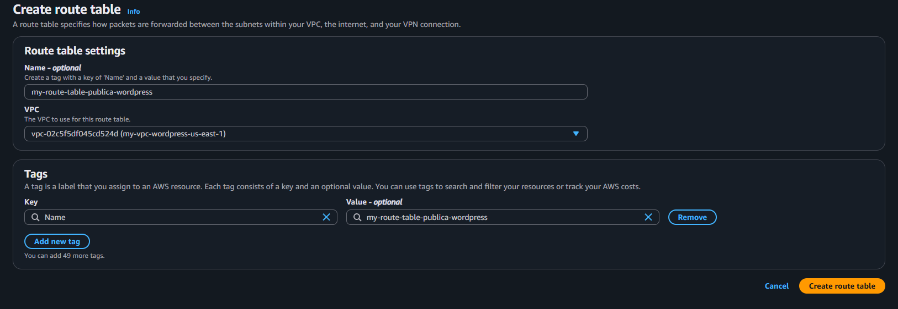

---

#### 📌 3. Criar a Route Table Privada
| Campo               | Valor                             |
|---------------------|-----------------------------------|
| **Name tag**        | `my-route-table-privada-wordpress`|
| **VPC**             | `(selecione sua vpc)`|

- Clique em Create route table.

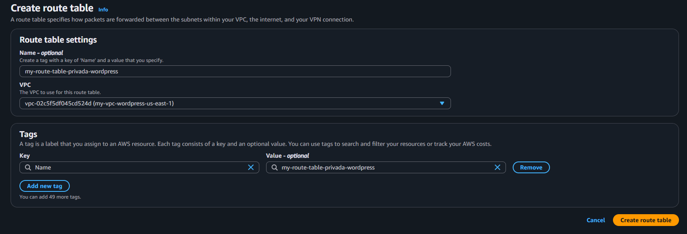

--- 

#### 📌 4. Associar Subnets Públicas à Route Table Pública
- Selecione `my-route-table-publica-wordpress`
- Vá na aba **Subnet associations**
- Clique em **Edit subnet associations**

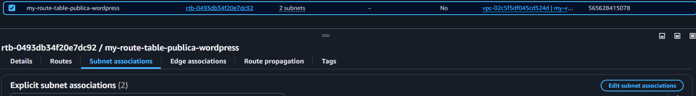

- Marque:
  - `my-subnet-public-1`
  - `my-subnet-public-2`

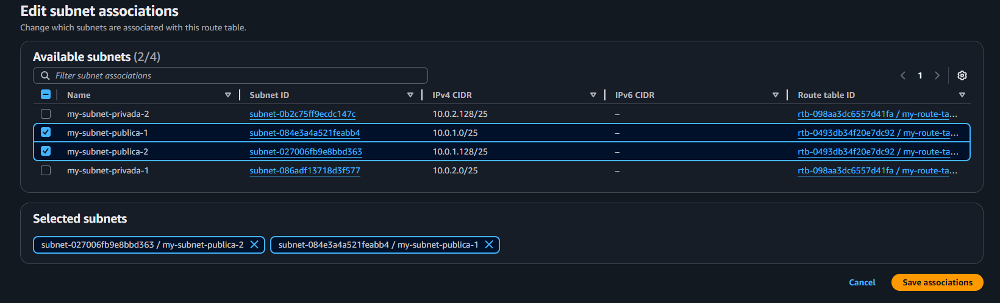

- Clique em **Save associations**

---

#### 📌 5. Associar Subnets Privadas à Route Table Privada
- Selecione `my-route-table-privada-wordpress`
- Vá na aba **Subnet associations**
- Clique em **Edit subnet associations**

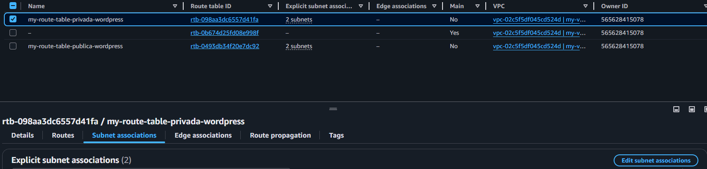

- Marque:
  - `my-subnet-privada-1`
  - `my-subnet-privada-2`

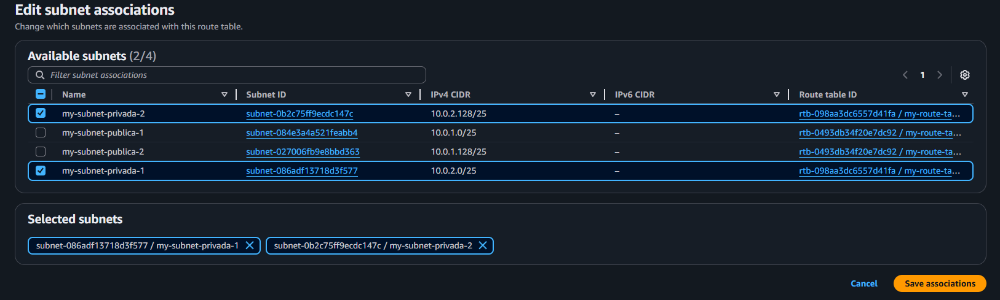

- Clique em **Save associations**

---

### 🧾 Resumo Técnico das Route Tables

| Route Table                        | Subnets associadas                           | Destino        | Alvo                             |
|------------------------------------|----------------------------------------------|----------------|----------------------------------|
| `my-route-table-publica-wordpress` | `my-subnet-public-1`, `my-subnet-public-2`   | `0.0.0.0/0`    | Internet Gateway (a ser criado)  |
| `my-route-table-privada-wordpress` | `my-subnet-privada-1`, `my-subnet-privada-2` | `0.0.0.0/0`    | NAT Gateway (a ser criado)       |

---

## 🌎 Etapa 4 - 🌐 Criação e Configuração do Internet Gateway (IGW)

### ✅ Objetivo
- Criar um Internet Gateway e associá-lo à VPC vpc-wordpress para permitir que as subnets públicas tenham acesso à internet.

### 🧭 Passo a Passo

#### 📌 1. Acessar o serviço de Internet Gateway
- Acesse o Console da AWS
- Vá para o serviço **VPC**
- No menu lateral esquerdo, clique em **Internet Gateways**

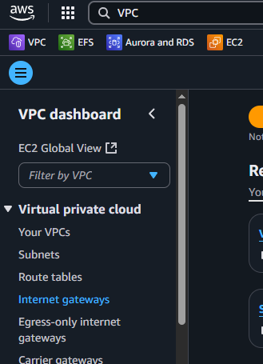
---

#### 📌 2. Criar o Internet Gateway
- Clique no botão **Create Internet Gateway**
- Defina o nome: `my-internet-gateway-wordpress`
- Clique em **Create Internet Gateway**

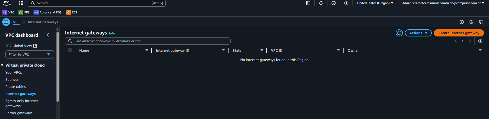

---

#### 📌 3. Nomear o Internet Gateway
- Informe um nome para o IGW, por exemplo: my-internet-gateway-wordpress-us-east-1.
- Clique em Create Internet Gateway.

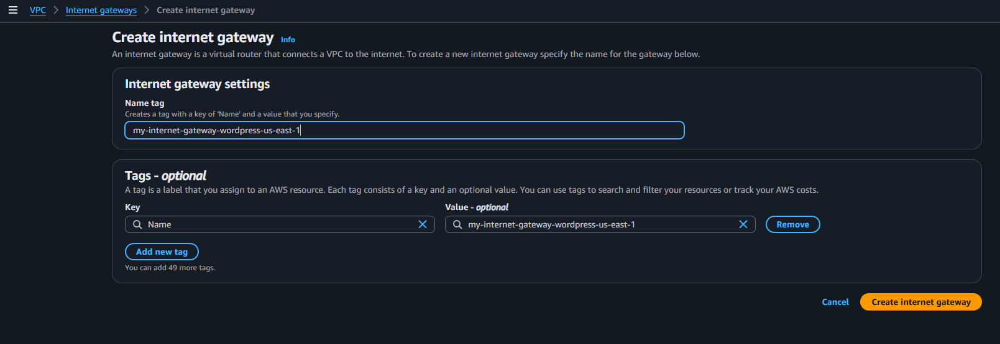

---

#### 📌 4. Associar o Internet Gateway à VPC
- Após criado, selecione o IGW na lista
- Clique em **Actions > Attach to VPC**
- Selecione a VPC `vpc-wordpress`
- Clique em **Attach Internet Gateway**

---

#### 📌 5. Atualizar a Route Table Pública
- Vá para **Route Tables**
- Selecione `my-route-table-publica-wordpress`
- Aba **Routes** > clique em **Edit routes**
- Adicione:
  - **Destination:** `0.0.0.0/0`
  - **Target:** selecione `my-internet-gateway-wordpress`

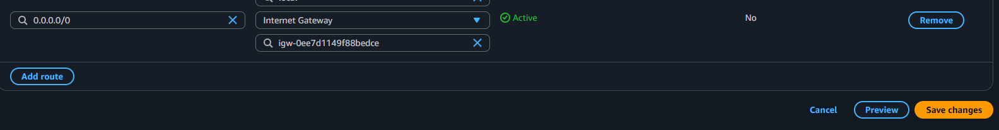

- Salve.
---

#### 📌 6. Verificar o acesso à internet
- Agora, as instâncias EC2 que estiverem nas subnets públicas poderão acessar a internet.
- Teste fazendo login em uma instância EC2 pública e tente pingar um endereço externo (por exemplo, ping google.com).

---

###  🧾 Resumo Técnico do Internet Gateway

| Propriedade          | Valor                         |
|----------------------|-------------------------------|
| Nome                 | `my-internet-gateway-wordpress` |
| VPC Associada        | `vpc-wordpress`               |
| Finalidade           | Acesso externo via subnets públicas |
| Status               | Attached                      |

---

## 🌎 Etapa 5 - 🔐 Configuração dos Security Groups

### ✅ Objetivo
- Criar regras de segurança (Security Groups) para controlar o tráfego entre os serviços da aplicação WordPress (EC2, RDS, EFS, Load Balancer), garantindo que apenas as comunicações necessárias sejam permitidas.

---

### 🧭 Passo a Passo
#### 📌 1. Acessar o serviço EC2
- No Console da AWS, vá em Serviços e busque por EC2.
- No menu lateral, clique em Security Groups.

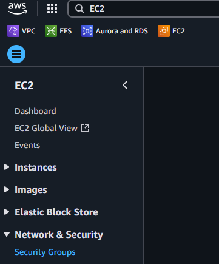

---

### 🔧 Criação e configuração dos Security Groups

### 🟢 1. SG da instância EC2
Nome: my-web-server-group-wordpress
- Clique em Create security group.
- Preencha:
    - Security group name: my-web-server-group-wordpress
    - Description: SG para instância EC2 WordPress
    - VPC: Selecione sua VPC

---

- Inbound rules:

| Type | Protocol | Port Range | Source                                             |
| ---- | -------- | ---------- | -------------------------------------------------- |
| HTTP | TCP      | 80         | Security Group: `my-web-server-group-loadbalancer` |

---

- Outbound rules:

| Type        | Protocol | Port Range | Destination |
| ----------- | -------- | ---------- | ----------- |
| All traffic | All      | All        | 0.0.0.0/0   |

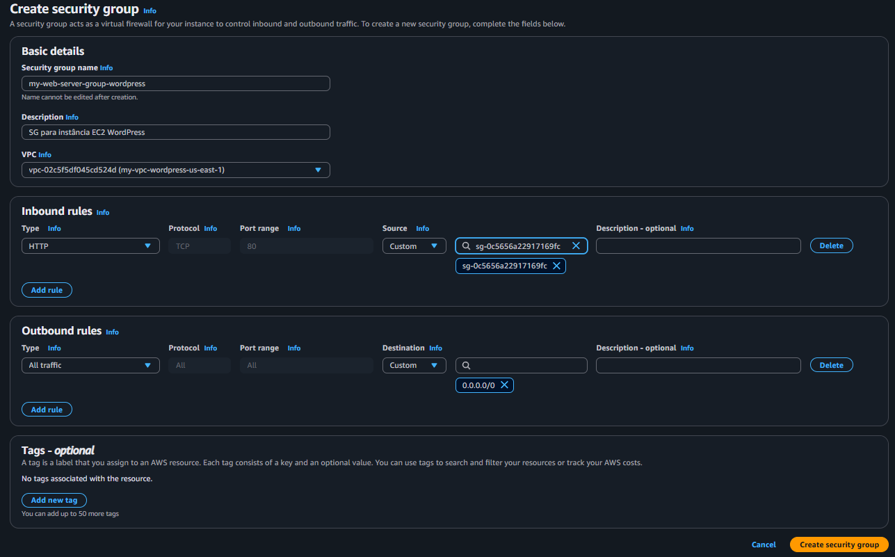

- Create security group
---

### 🟣 2. SG do banco de dados RDS
Nome: my-web-server-group-wordpress-rds
- Clique em Create security group.
- Preencha:
    - Security group name: my-web-server-group-wordpress-rds
    - Description: SG para instância RDS
    - VPC: Selecione sua VPC

---

- Inbound rules:

| Type         | Protocol | Port Range | Source                                          |
| ------------ | -------- | ---------- | ----------------------------------------------- |
| MySQL/Aurora | TCP      | 3306       | Security Group: `my-web-server-group-wordpress` |


---

- Outbound rules:

| Type        | Protocol | Port Range | Destination |
| ----------- | -------- | ---------- | ----------- |
| All traffic | All      | All        | 0.0.0.0/0   |


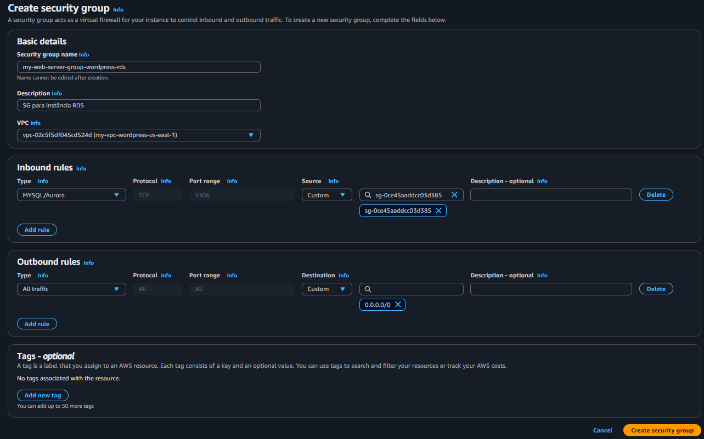

- Create security group

---

### 🟠 3. SG do EFS
Nome: my-web-server-group-wordpress-efs
- Clique em Create security group.
- Preencha:
    - Security group name: my-web-server-group-wordpress-efs
    - Description: SG para o sistema de arquivos EFS
    - VPC: Selecione sua VPC

---

- Inbound rules:

| Type | Protocol | Port Range | Source                                          |
| ---- | -------- | ---------- | ----------------------------------------------- |
| NFS  | TCP      | 2049       | Security Group: `my-web-server-group-wordpress` |


---

- Outbound rules:

| Type        | Protocol | Port Range | Destination |
| ----------- | -------- | ---------- | ----------- |
| All traffic | All      | All        | 0.0.0.0/0   |


- Create security group

---

### 🔵 4. SG do Load Balancer
Nome: my-web-server-group-loadbalancer
- Clique em Create security group.
- Preencha:
    - Security group name: my-web-server-group-loadbalancer
    - Description: SG para o Load Balancer
    - VPC: Selecione sua VPC

---

- Inbound rules:

| Type | Protocol | Port Range | Source    |
| ---- | -------- | ---------- | --------- |
| HTTP | TCP      | 80         | 0.0.0.0/0 |


---

- Outbound rules:

| Type        | Protocol | Port Range | Destination |
| ----------- | -------- | ---------- | ----------- |
| All traffic | All      | All        | 0.0.0.0/0   |


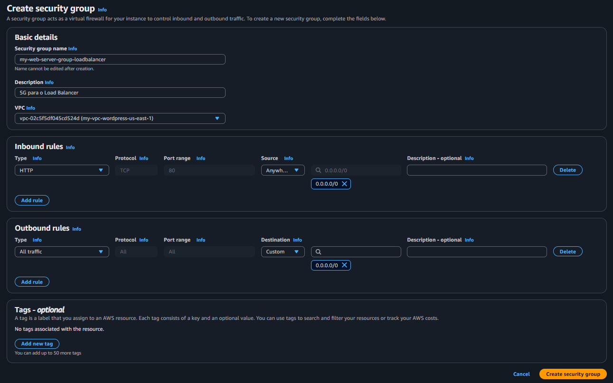

- Create security group

---

###  🧾 Resumo técnico dos Security Groups

| SG Name                             | Inbound Rules (Permitir de) | Portas | Para que serve                              |
| ----------------------------------- | --------------------------- | ------ | ------------------------------------------- |
| `my-web-server-group-wordpress`     | SG da EC2       | 80     | EC2 com WordPress                           |
| `my-web-server-group-wordpress-rds` | SG do RDS                   | 3306   | Banco de Dados MySQL                        |
| `my-web-server-group-wordpress-efs` | SG do EFS                   | 2049   | Sistema de arquivos compartilhado (EFS)     |
| `my-web-server-group-loadbalancer`  | SG do Load Balancer        | 80     | Load Balancer que recebe requisições da web |

---

## 🌎 Etapa 6 - 🌐 Configurando o NAT Gateway para a Sub-rede Privada

### ✅ Objetivo
- Permitir que a sub-rede privada (onde está o RDS, por exemplo) possa acessar a internet somente para saída, como para atualizações e instalações, sem estar exposta publicamente. Isso é feito usando um NAT Gateway.

---

### 🧭 Passo a Passo
#### 🔧 1. Criar o NAT Gateway
1. No Console da AWS, vá até o serviço VPC.
2. No menu lateral, clique em NAT Gateways.
3. Clique em Create NAT Gateway.

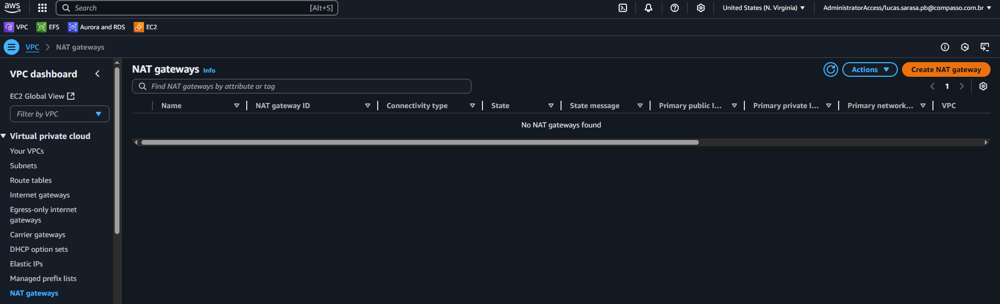
4. Preencha os campos da seguinte forma:
    - Name: my-nat-gateway-wordpress
    - Subnet: selecione uma sub-rede pública
    - Elastic IP allocation ID: marque a opção Allocate Elastic IP (a AWS criará um EIP automaticamente)
5. Clique em Create NAT Gateway.

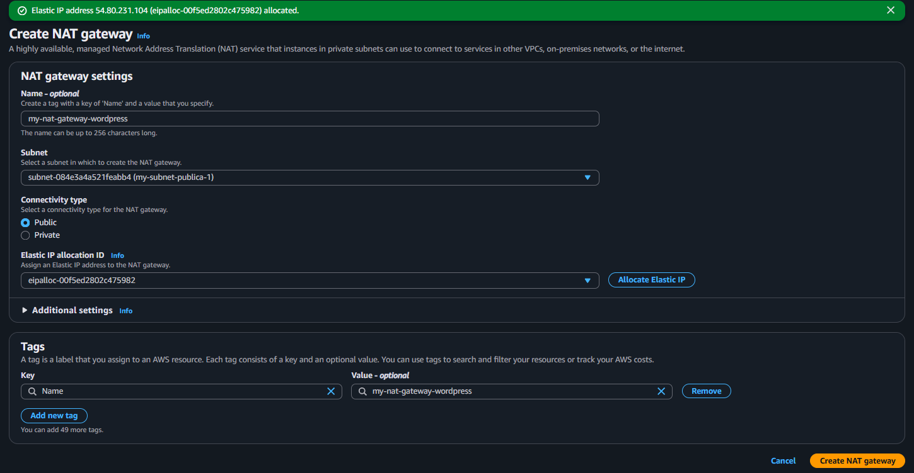
6. Aguarde até que o Status mude para Available.

#### 🔧 2. Configurar a Route Table da Sub-rede Privada
1. No Console da AWS, vá até Route Tables (ainda no serviço VPC).
2. Selecione a my-route-table-privada-wordpress.
3. Vá até a aba Routes e clique em Edit routes.

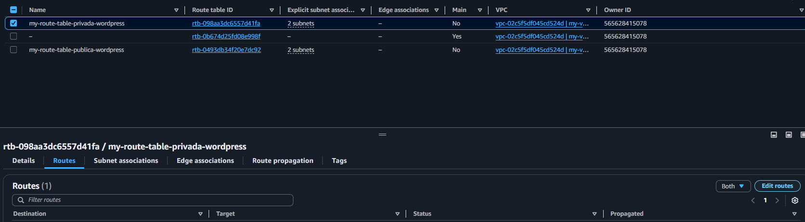
4. Adicione a seguinte rota:
    - Destination: 0.0.0.0/0
    - Target: selecione NAT Gateway e escolha o my-nat-gateway-wordpress

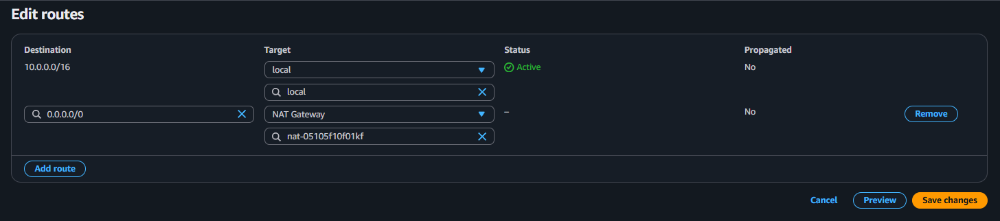
5. Clique em Save changes.

#### 🔁 Confirmar associação com a sub-rede privada
1. Ainda na mesma Route Table, vá na aba Subnet associations.
2. Clique em Edit subnet associations (se necessário).
3. Certifique-se de que a sub-rede privada (onde está o RDS ou outro recurso sem IP público) está selecionada.
4. Clique em Save associations.

---

### 🧾 Resumo técnico da Configuração do NAT Gateway
- Criado NAT Gateway em subnet pública com Elastic IP para permitir acesso à internet pela subnet privada.
- Atualizada route table da subnet privada para direcionar todo tráfego externo (0.0.0.0/0) para o NAT Gateway.
- Garantida associação correta da route table com a subnet privada para que recursos sem IP público (ex: EC2, RDS) possam acessar a internet para atualizações e downloads.
- Segurança mantida, pois o NAT Gateway permite somente tráfego de saída, evitando exposição direta da subnet privada à internet.

---

## 🌎 Etapa 7 - 🛢️ Criando o RDS (MySQL) para o WordPress

### ✅ Objetivo
- Criar um banco de dados gerenciado MySQL que será utilizado pelo WordPress.

---
### 🧭 Passo a Passo – RDS
1. Acesse o Console da AWS e vá até o serviço RDS.
2. Clique em Create database.
3. Selecione a opção Standard Create.
4. Em Engine options:
    - Engine type: MySQL
    - Version: escolha a versão recomendada ou desejada.
5. Em Templates, escolha Free tier ou Dev/Test (conforme o caso).

#### Configurações da instância:
- DB instance identifier: wordpress-db
- Master username: escolha um nome, ex: admin
- Master password: defina uma senha forte
- DB instance class: db.t3.micro (ou outra compatível)
- Storage: 20 GiB (padrão)

#### Configurações de rede:
- Virtual Private Cloud (VPC): selecione sua VPC WordPress
- Subnet group: deixe o padrão ou selecione um que contenha sub-redes privadas
- Public access: No
- VPC security group: selecione my-web-server-group-wordpress-rds
- Availability zone: deixe padrão ou escolha uma específica

#### Configurações adicionais:
- Expanda a seção Additional configuration
- Initial database name: db_wordpress
(esse será o nome do banco de dados que o WordPress usará para se conectar)

#### Finalizar:
- Clique em Create database
- Aguarde o status mudar para Available
- Anote o endpoint para uso na aplicação WordPress

---

### 🧾 Resumo técnico da criação do RDS
- Banco de dados gerenciado MySQL para WordPress
- Instância: db.t3.micro, 20 GiB de armazenamento
- Rede: VPC personalizada com sub-redes privadas
- Segurança: Security Group configurado para acesso restrito
- Acesso público: Desativado (No)
- Banco inicial criado: db_wordpress
- Endpoint anotado para conexão do WordPress
- Alta disponibilidade garantida pelo serviço RDS da AWS

## 🌎 Etapa 8 - 🛢️ Criando o EFS (Elastic File System)

### ✅ Objetivo
- Prover armazenamento compartilhado entre múltiplas instâncias EC2 (ex: uploads do WordPress).

---

### 🧭 Passo a Passo – EFS
1. Acesse o Console da AWS e vá até o serviço EFS.
2. Clique em Create file system.
3. Configure:
    - Name: wordpress-efs
    - VPC: selecione a mesma VPC usada no projeto
4. Clique em Customize (para configurações avançadas)

#### Configurações de Rede:
- Subnets + Security groups:
    - Para cada AZ desejada, associe uma sub-rede pública com o Security Group: my-web-server-group-wordpress-efs
    - Isso garante que a EC2 possa montar o EFS via NFS (porta 2049)

#### Outras opções:
- Deixe as opções padrão ou ajuste conforme o uso (ex: performance, throughput)

5. Clique em Create file system

---

### 📎 Anotar o ID do EFS
- Depois de criado, anote o File system ID
- Use o comando mount -t efs ou amazon-efs-utils para montar na EC2

---

### Resumo técnico da criação do EFS
- Sistema de arquivos compartilhado via NFS para múltiplas instâncias EC2
- Associado à VPC personalizada usada no projeto
- Configuração de subnets públicas para permitir montagem via NFS
- Security Group específico para acesso controlado à porta 2049
- Montagem do EFS feita via NFS (pacote nfs-utils) na instância EC2
- Pacote amazon-efs-utils instalado para suporte adicional e melhores práticas
- Permite armazenamento persistente e compartilhado (ex: uploads WordPress)

---

## 🌎 Etapa 9 - 🚀 Guia de Criação da Instância EC2 (Amazon Linux 2)

### ✅ Objetivo
- Criar uma instância EC2 para hospedar o WordPress.
---

### 🧭 Passo a Passo
### 1️⃣ Acesse o serviço EC2
- No menu de serviços, digite EC2 e clique no resultado
- Você estará no painel do EC2

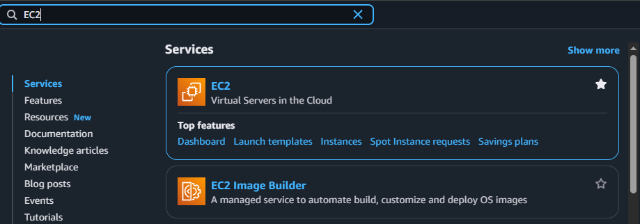

---

### 2️⃣ Criar nova instância EC2
- Clique no botão Launch instances

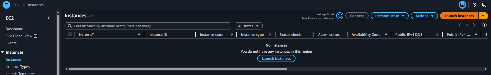

---

### Configurações da EC2:

### 3️⃣ Definir o nome da instância
- No topo da página, localize o campo Name e insira um nome para sua instância, por exemplo:
wordpress-server-instance

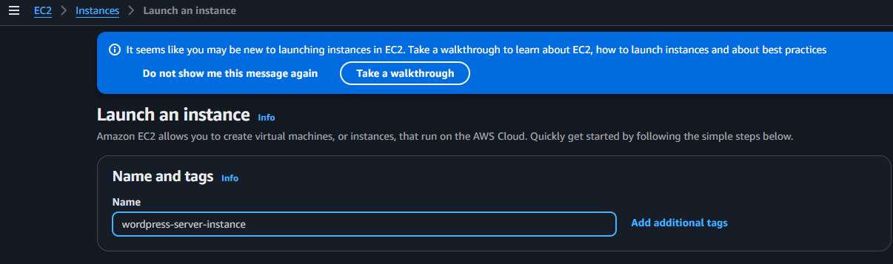

---

### 4️⃣ Escolher a Amazon Machine Image (AMI) e Instance type
- 🖥️ Selecione a AMI Amazon Linux 2 AMI (HVM), SSD Volume Type (geralmente a primeira da lista)
- ⚡ Escolha o tipo t2.micro (grátis na camada free tier)

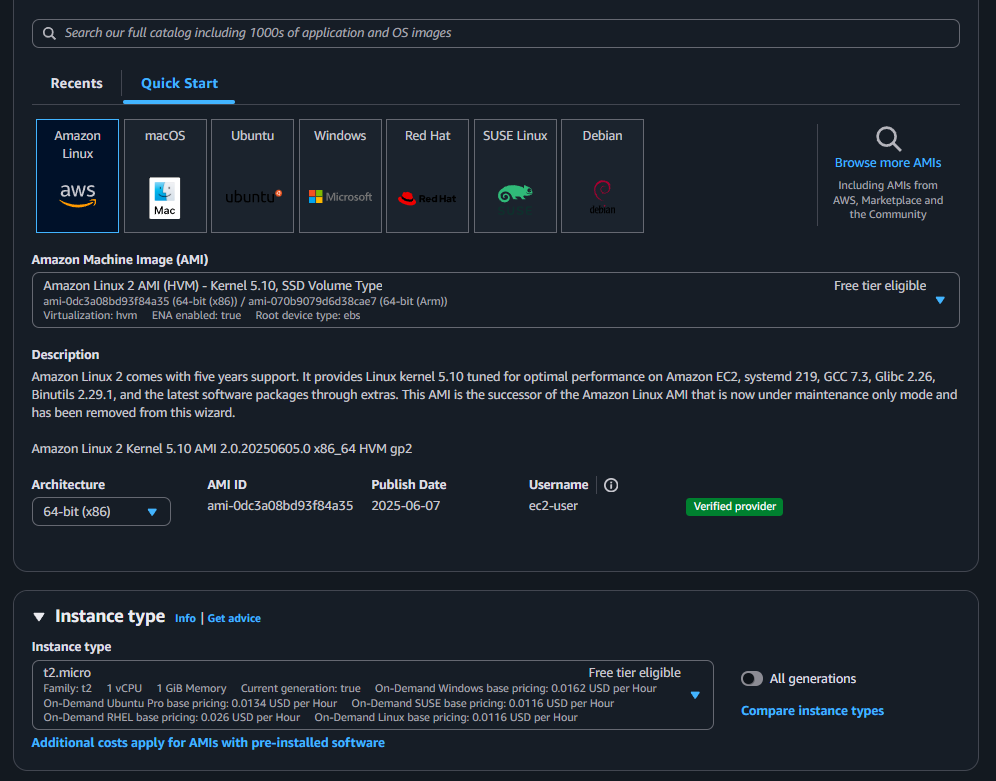

---

### 5️⃣ Par de chaves
- 🔑 Selecione o par de chaves (no meu caso "minha-instancia-us")
- ⚠️ Certifique-se de ter o arquivo .pem para acesso SSH

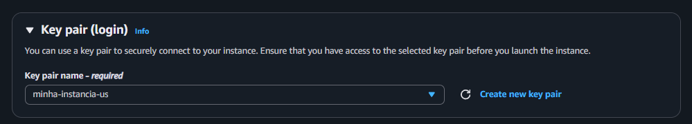
- Ou crie um par de chaves

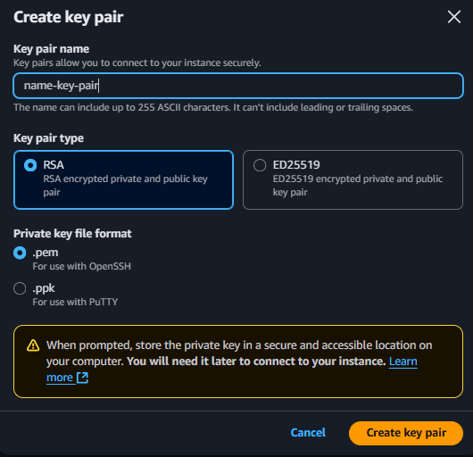

---

### 6️⃣ Configurar detalhes da instância (Network Settings)

- ⚙️ Na etapa de configuração da instância, defina o seguinte:
    - Selecione a VPC criada anteriormente, por exemplo, my-vpc.
    - Escolha a sub-rede privada chamada my-subnet-privada-1.
    - Desative a opção Auto-assign Public IP (deixe desmarcada para que a instância não receba IP público).
    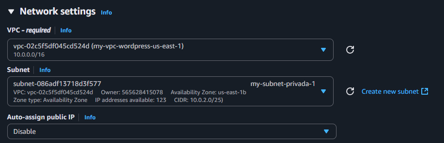

---

### 7️⃣ Configurar o grupo de segurança (Security Group)

- 🔐 Na tela de configuração de segurança, selecione o grupo de segurança existente chamado my-web-server-group-wordpress. Esse grupo já está configurado para permitir o tráfego HTTP na porta 80 vindo do Load Balancer, garantindo o acesso correto à sua aplicação.

---

### 8️⃣ Configurar User Data (script de inicialização)
- Antes de clicar em Launch, volte para a etapa Configure Instance Details (Passo 6)
- Role a tela para Advanced Details
- Cole o script abaixo no campo User data:
```bash
#!/bin/bash

# Atualiza o sistema e instala docker e cliente NFS
yum update -y
yum install -y docker amazon-efs-utils nfs-utils

# Inicia e habilita docker
systemctl start docker
systemctl enable docker
usermod -aG docker ec2-user

# Criar diretório para montar o EFS
mkdir -p /mnt/efs/wp-content

# Montar o EFS usando nfs4
mount -t nfs4 <seu-dns-do-efs.amazon>:/ /mnt/efs

# Opcional: adiciona no fstab para montar no boot
echo "<seu-dns-do-efs.amazon>:/ /mnt/efs nfs4 defaults,_netdev 0 0" >> /etc/fstab

# Dar um tempo para garantir que o Docker está pronto
sleep 10

# Dar o pull na imagem do wordpress
docker pull wordpress:latest

# Variáveis do banco
DB_HOST="<sua-url-do-database>"
DB_USER="seu-usuario"
DB_PASS="sua-senha-usuario"
DB_NAME="seu-banco"

# Rodando o container na porta 80, passando as variáveis do banco pro wordpress
docker run -dp 80:80 --name wordpress \
  -v /mnt/efs/wp-content:/var/www/html/wp-content \
  -e WORDPRESS_DB_HOST=$DB_HOST:3306 \
  -e WORDPRESS_DB_USER=$DB_USER \
  -e WORDPRESS_DB_PASSWORD=$DB_PASS \
  -e WORDPRESS_DB_NAME=$DB_NAME \
  wordpress:latest
```

---

### 9️⃣ Revisar e lançar a instância
- ✅ Confira todas as configurações
- 🚀 Clique em Launch instance

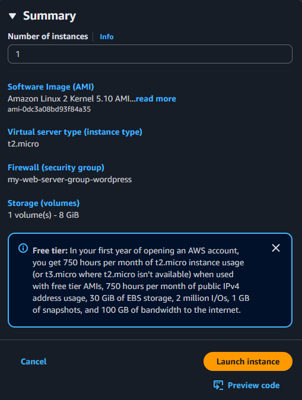

---

### 🔟 Verificar a instância
- Vá no painel do EC2 > Instances
- Verifique se a instância foi criada com sucesso
- Aguarde até o status ficar:
    - Instance state: running
    - Status checks: 2/2 checks passed ✅

---

### 🧾 Resumo técnico da criação da EC2
- AMI: Amazon Linux 2
- Tipo de instância: t2.micro
- Par de chaves: minha-instancia-us
- VPC: VPC criada personalizada
- Subnet: my-subnet-privada-1 (subnet privada, sem IP público)
- IP público: Desabilitado
- Security Group: my-web-server-group-wordpress (libera HTTP apenas do SG do Load Balancer)
- User Data:
    - Atualiza o sistema e instala Docker + cliente NFS
    - Configura Docker para iniciar automático
    - Monta o EFS em /mnt/efs para persistência do conteúdo WordPress
    - Faz pull da imagem oficial do WordPress
    - Roda container WordPress ligado ao RDS via variáveis de ambiente

---

## 🌎 Etapa 10 - 🎯 Criação do Target Group

### ✅ Objetivo
- Criar um Target Group para gerenciar o tráfego do Load Balancer ao WordPress.

---

### 🧭 Passo a Passo
1️⃣ No console AWS, vá para EC2 > Target Groups no menu lateral.

2️⃣ Clique em Create target group.

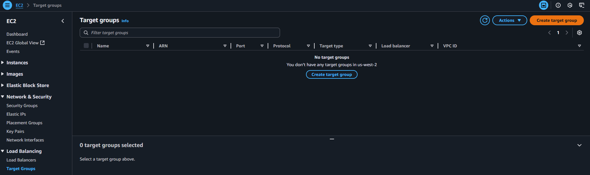

3️⃣ Configure os seguintes campos:

- Target type: Instances

- Name: my-target-group-wordpress (ou outro nome que desejar)

- VPC: Selecione a VPC correta onde suas instâncias estão (ex: sua VPC personalizada)

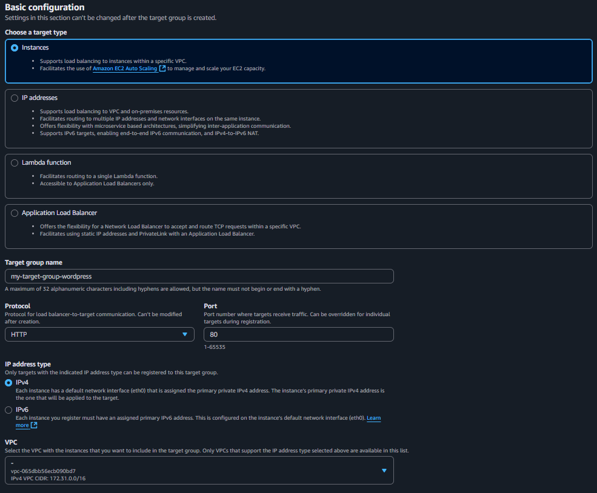

4️⃣ Role para baixo até a seção Health checks e configure:
- Protocol: HTTP
- Path: /wp-admin/install.php (raiz do wordpress para verificar saúde)
- Healthy threshold: 2
- Unhealthy threshold: 2
- Timeout: 5 segundos
- Interval: 15 segundos

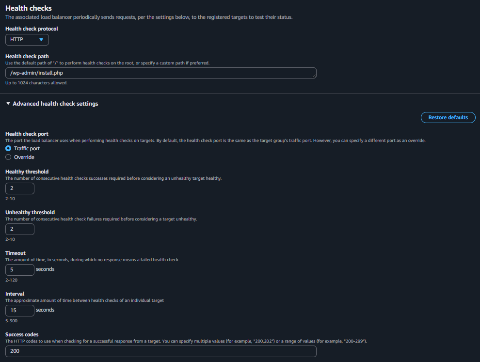

5️⃣ Clique em Next

6️⃣ Selecione as instâncias EC2 que devem ser registradas nesse Target Group (ex: sua instância WordPress privada).

7️⃣ Clique em Create target group.

--- 

### 🧾 Resumo técnico da criação do Target Group
- Tipo de Target: Instances
- Nome: my-target-group-wordpress
- VPC: VPC onde as instâncias estão provisionadas
- Health check:
    - Protocolo: HTTP
    - Path: /wp-admin/install.php
    - Healthy threshold: 2
    - Unhealthy threshold: 2
    - Timeout: 5 segundos
    - Intervalo: 15 segundos
- Registro de instâncias: Instâncias EC2 selecionadas (ex: instância WordPress)
- Finalidade: Direcionar tráfego do Load Balancer para instâncias específicas, monitorando a saúde via health check para garantir alta disponibilidade e desempenho.

---

## 🌎 Etapa 11 - 🚦 Configuração do Load Balancer para WordPress

### ✅ Objetivo
- Configurar um Application Load Balancer na AWS para distribuir de forma eficiente o tráfego HTTP externo para as instâncias EC2 privadas que hospedam o WordPress, garantindo alta disponibilidade, segurança e escalabilidade da aplicação.

### 🧭 Passo a Passo para criar o Load Balancer
1️⃣ Acessar o console da AWS
- No AWS Management Console, vá para o serviço EC2 e no menu lateral clique em Load Balancers.

2️⃣ Criar novo Load Balancer
- Clique em Create Load Balancer.

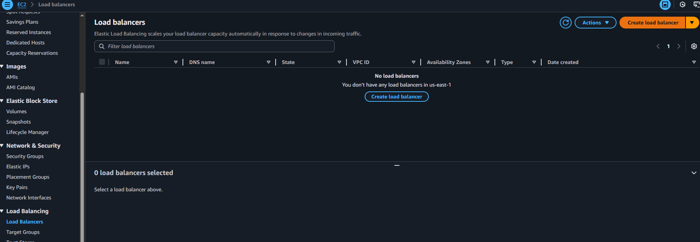

3️⃣ Selecionar tipo
- Escolha Application Load Balancer.

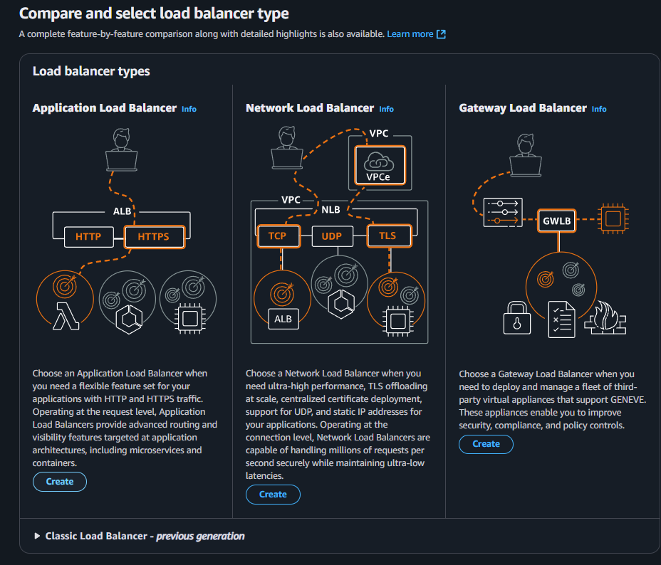

4️⃣ Configurar Load Balancer

- 🏷️ Name: my-loadbalancer-wordpress

- 🌐 Scheme: internet-facing (para ser acessível pela internet)

- 🗺️ VPC: selecione a VPC onde suas subnets públicas estão configuradas

- 📍 Availability Zones: selecione as 2 subnets públicas para alta disponibilidade

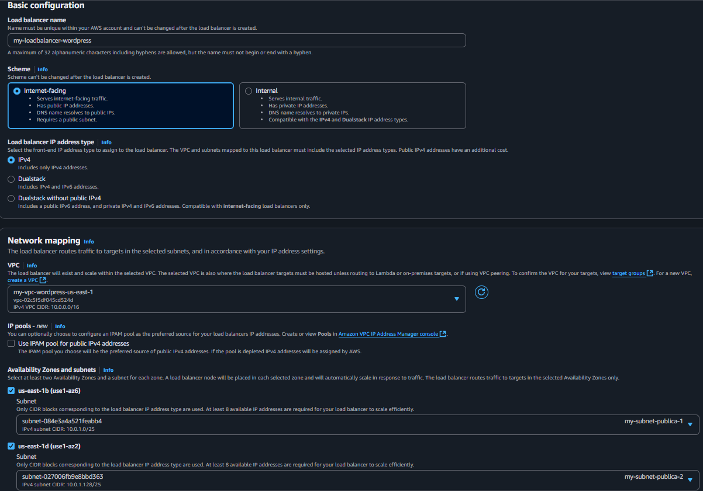

5️⃣ Configurar Security Group

- 🔐 Selecione o SG my-web-server-group-loadbalancer que permite inbound HTTP na porta 80 para 0.0.0.0/0.

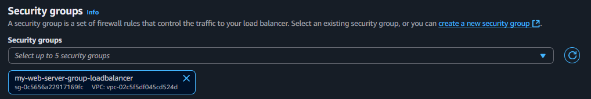

6️⃣ Configurar Listener e Target Group

🔄 Listener padrão HTTP na porta 80

- 🎯 Selecione o target group criado para WordPress (GP-DESTINO-WP)

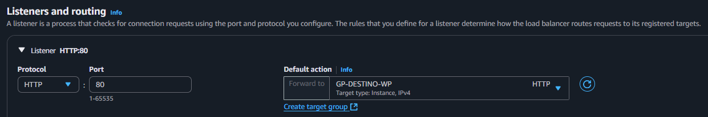

7️⃣ Adicionar Tags (opcional)

- 🏷️ Tags para organização, exemplo: Name: my-loadbalancer-wordpress

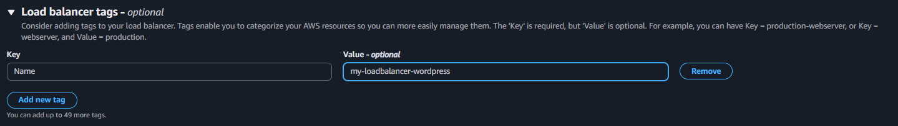

8️⃣ Revisar e criar

- ✔️ Verifique todas as configurações e clique em Create Load Balancer.

### 🧾 Resumo técnico da criação do Load Balancer
- Nome: my-loadbalancer-wordpress
- Esquema: internet-facing (acessível externamente)
- VPC: VPC com subnets públicas configuradas
- Subnets: 2 subnets públicas para alta disponibilidade
- Security Group: my-web-server-group-loadbalancer (inbound HTTP 80 de 0.0.0.0/0)
- Target Group: GP-DESTINO-WP com instâncias EC2 privadas registradas
- Função: Distribuir o tráfego HTTP externo para as instâncias WordPress em subnets privadas, garantindo balanceamento de carga e alta disponibilidade.

---

## 🌎 Etapa 12 - 🤖 Configuração do Auto Scaling Group para WordPress

### ✅ Objetivo
- Configurar um Auto Scaling Group (ASG) para garantir que as instâncias EC2 que hospedam o WordPress escalem automaticamente conforme a demanda, mantendo a disponibilidade e performance da aplicação, enquanto otimizam custos.

---

### 🧭 Passo a Passo para criar o Auto Scaling Group
1️⃣ Acessar o console da AWS
- No AWS Management Console, vá para o serviço EC2 e no menu lateral clique em Auto Scaling Groups.

---

2️⃣ Criar Auto Scaling Group
- Clique em Create Auto Scaling group.

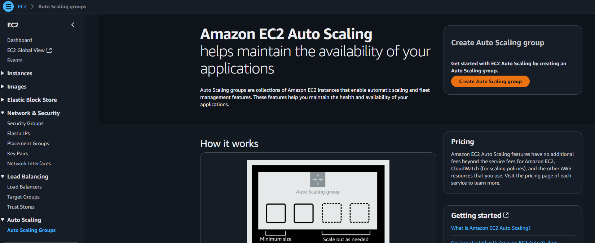

---

3️⃣ Configuração do Auto Scaling Group
- Defina o nome do grupo.
- Escolha um launch template existente (ou crie um novo se ainda não tiver).
- Next

3️⃣.1️⃣ Criação do Launch Template (se não tiver um)

Se você ainda não possui um launch template para o Auto Scaling Group, siga os passos abaixo para criar:
1. No Console AWS, vá para EC2 > Launch Templates.
2. Clique em Create launch template.

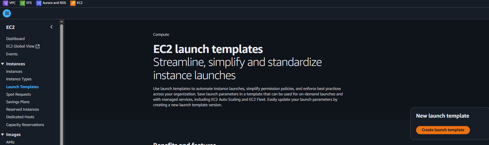

3. Defina um Nome para o template, por exemplo: lt-wordpress.

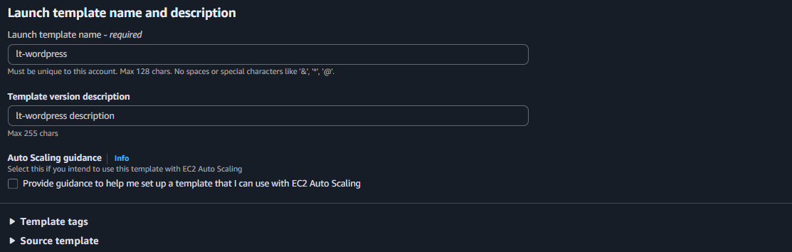

4. Em AMI, selecione a Amazon Linux 2 (ou a AMI que preferir).
5. Escolha o tipo de instância (ex: t2.micro).

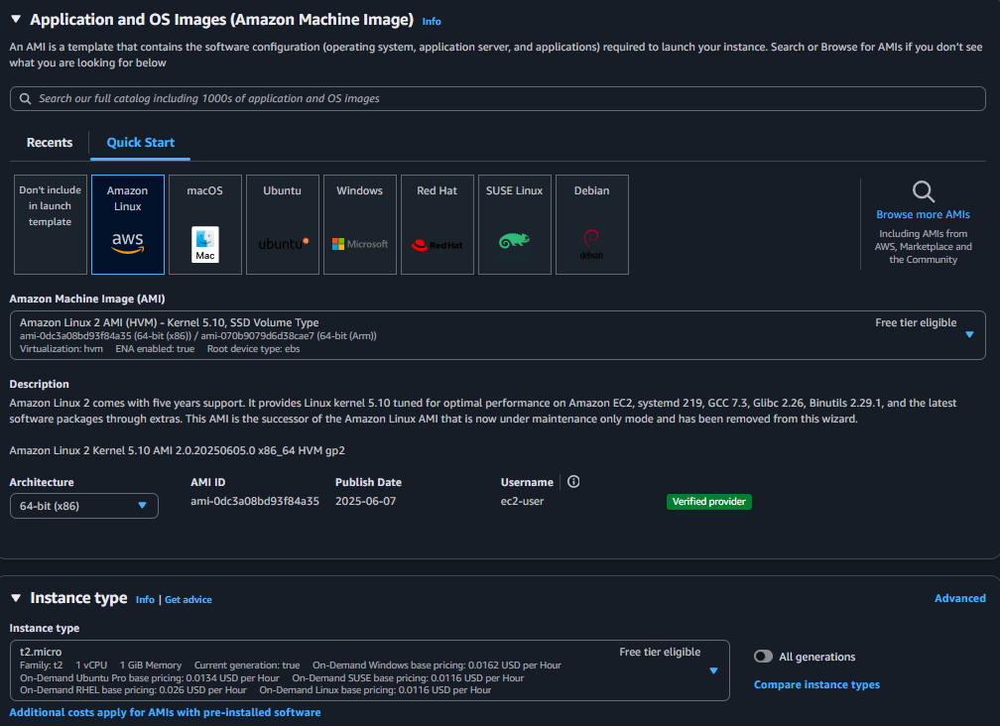

6. Selecione o par de chaves (key pair) para acesso SSH.

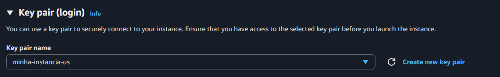

7. Em Security groups, selecione o grupo my-web-server-group-wordpress (Security groups da EC2).

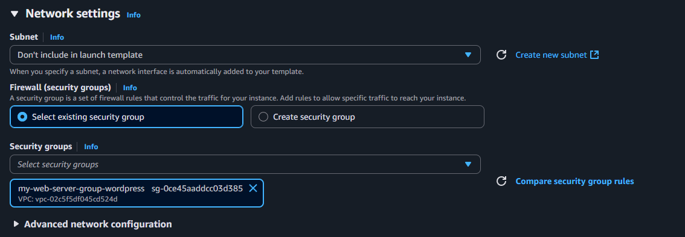

8. Em User data, cole o script de inicialização que você usa para configurar o WordPress, Docker, EFS etc
9. Configure outras opções conforme necessário (ex: volume, rede, tags).
10. Clique em Create launch template.

---

4️⃣ Configurar rede
- Selecione a VPC do projeto.
- Selecione as subnets privadas para rodar as instâncias.
- Next


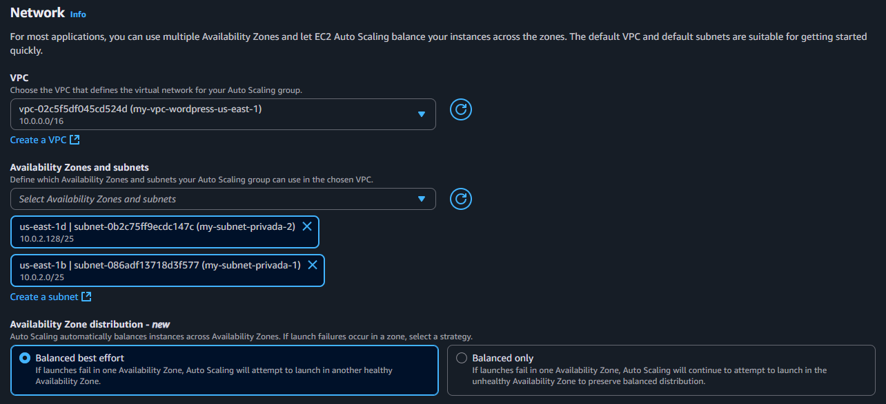

---

5️⃣ Selecionar target group existente 

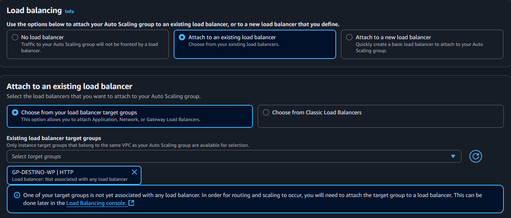
---

6️⃣ Health check
- Escolha a primeira opção de health check (EC2).

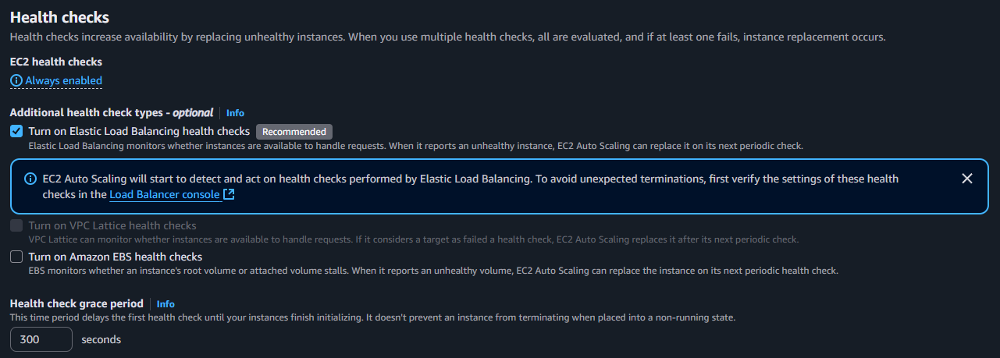

---

7️⃣ Configurar capacidade e **Regras de Auto Scaling automático**
- Desired capacity: 2
- Min capacity: 2
- Max capacity: 4
- Baseie o scaling na utilização da CPU > 50%.

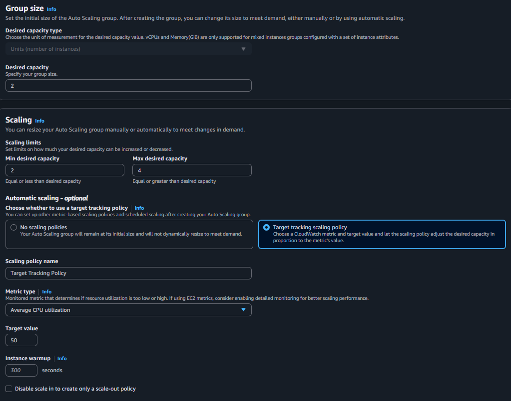

---

9️⃣ Notificações
- Configure o envio de e-mail para receber alertas sobre o grupo.


---

🔟 Tags
- Adicione pelo menos uma tag, por exemplo:
- Key: Name
- Value: my-auto-scaling-wordpress

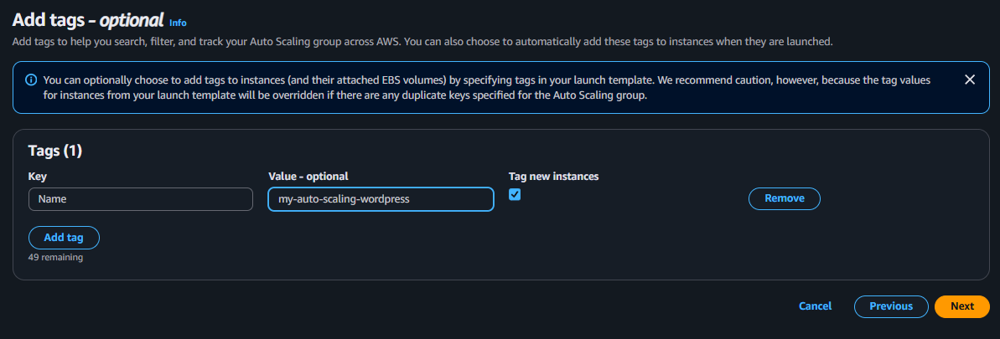

---

1️⃣1️⃣ Revisar e criar
- Revise as configurações e selecione **Create Auto Scaling group**.

---

### 🧾 Resumo técnico da criação do Auto Scaling Group
- Nome: my-auto-scaling-wordpress
- Launch Template: com configuração de instância Amazon Linux 2 e User Data para rodar WordPress via Docker
- VPC: VPC com subnets privadas configuradas
- Subnets: my-subnet-privada-1 e my-subnet-privada-2 para distribuir instâncias em múltiplas zonas de disponibilidade
- Security Group: my-web-server-group-wordpress (permite HTTP apenas do Load Balancer)
- Health Check: EC2 (verifica o status da instância para substituição automática se necessário)
    - Desejado (Desired): 1 instância
    - Mínimo (Min): 1 instância
    - Máximo (Max): 2 instâncias
    - Política de Auto Scaling: escala automaticamente com base na utilização de CPU ≥ 50%
- Notificações: alerta por e-mail configurado via SNS
- Tags: Name = my-auto-scaling-wordpress
- Função: Garantir alta disponibilidade e escalabilidade automática da aplicação WordPress, mantendo pelo menos uma instância ativa e aumentando conforme a carga de uso.

---

## 🌎 Etapa 13 - 📊 Configuração do Amazon CloudWatch para monitoramento

### ✅ Objetivo
- Implementar monitoramento contínuo dos recursos do projeto WordPress (EC2, RDS, EFS, ALB) utilizando o Amazon CloudWatch, para coletar métricas, visualizar gráficos e configurar alarmes que garantam a disponibilidade, desempenho e alertas em tempo real.

---

### 🧭 Passo a Passo para configurar o CloudWatch
#### 1️⃣ Acessar o Console AWS
- No AWS Management Console, busque e acesse o serviço CloudWatch.

---

#### 2️⃣ Criar alarmes para métricas críticas
- No menu lateral, clique em Alarms > Create Alarm.
- Clique em Select metric.

---

#### 3️⃣ Selecionar métricas da instância EC2
- Navegue em: EC2 > Per-Instance Metrics > [selecione sua instância] > CPUUtilization.
- Defina o limite (threshold) do alarme:
- Quando a CPU estiver acima de 70% por 3 períodos consecutivos de 5 minutos.
- Clique em Next.

---

#### 4️⃣ Configurar ações do alarme
- Em ações, escolha In alarm > Send a notification to... e selecione ou crie um tópico SNS.
- Para criar um tópico SNS:
    - Clique em Create topic.
    - Defina um nome, por exemplo: alertas-wordpress.
    - Adicione seu e-mail para receber notificações.
- Clique em Create alarm.
- Você receberá um e-mail para confirmar a inscrição no tópico SNS — confirme para ativar as notificações.

---

#### 5️⃣ Criar um Dashboard personalizado
- No menu lateral, clique em Dashboards > Create dashboard.
- Defina um nome, por exemplo: Dashboard-Wordpress.
- Clique em Add widget e selecione o tipo de gráfico (Line, Number, etc).
- Adicione as métricas que desejar monitorar, por exemplo:
    - CPUUtilization da EC2
    - RequestCount e HTTPCode_ELB_5XX do ALB (Application Load Balancer)
    - FreeStorageSpace do RDS
    - Throughput do EFS
- Organize os widgets para facilitar a visualização.

---

#### 6️⃣ Monitorar o dashboard regularmente
- Use o dashboard para acompanhar o desempenho e saúde dos recursos.
- Combine com os alarmes para responder rapidamente a qualquer problema.

---

### 🧾 Resumo técnico da configuração do CloudWatch
- Alarmes configurados para:
    - CPU da EC2 > 70%
    - Erros 5XX no ALB
    - Espaço livre no RDS
- Tópico SNS criado para envio de notificações por e-mail.
- Dashboard personalizado criado com métricas essenciais do ambiente.
- Monitoramento contínuo para garantir performance e disponibilidade.

---

## 🛠️ Tecnologias utilizadas 🛠️

- Docker
- Amazon EC2
- Amazon RDS (MySQL)
- Amazon EFS
- Amazon VPC (subnets, route tables, NAT Gateway...)
- Elastic Load Balancer (ALB) 
- Security Groups
- Auto Scaling Group (com políticas baseadas em métricas)
- Amazon CloudWatch (monitoramento e alarmes)
- Amazon SNS (notificações)
- Amazon Launch Templates (configuração de instâncias EC2)
<br>
<br>
<br>
---

**👨‍💻 Autor: Lucas Sarasa**<br>
🔗 [LinkedIn](https://www.linkedin.com/in/lucassarasa)  
📧 lucasmsarasa@gmail.com

---